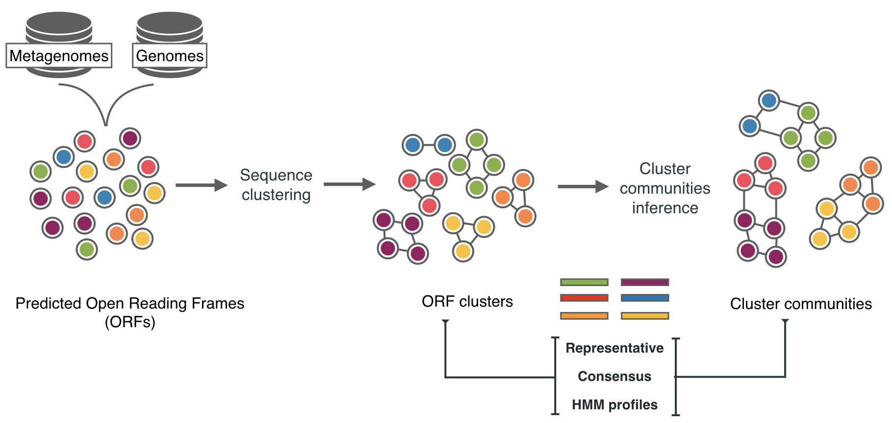

# Dark metagenomics
### Mining the dark side of genommes and metagenomes

For a complete overview of our approach to mine the microbial functional dark side visit the website [The functional dark side](https://dark.metagenomics.eu/).

### INTRO

Large-scale metagenomic surveys have generated terabytes of sequence data from a multitude of ecosystems, redefining microbial protein diversity (Land et al. 2015). However, our functional understanding of microbial communities is strongly constrained by the large fraction of still uncharacterised genes. The proportion of unknowns is considerably large in both sequenced genomes, where it is estimated around 30% (Price et al. 2018; Bernard et al. 2018), and metagenomes, where it ranges from 40% to 60% (Carradec et al. 2018) of the genes in the datasets. Considering the size and the extension of the “unknown problem” (Hurwitz and Sullivan 2013), and the obstacles it poses in metabolic reconstructions and, consequently in the study of microbial interactions with the environments, tackling the characterization of the unknowns should be considered a primary challenge for biologist (Hanson et al. 2009; Bernard et al. 2018). We used a sequence clustering approach to start bringing structure and categorise the UNKNOWN functional space. We consider gene clusters our starting point and a proxy to protein families. And we focused our methodology on an in-depth classification of these clusters based on different degrees of functional characterisation. Since we lack a unified and practical categorization of the KNOWN and UNKNOWN functional space, we proposed five main gene cluster categories:
**Knowns with PFAM (Ks):** ORF clusters annotated with PFAM domains of known function. \

**Knowns without PFAMs (KWPs):** clusters of ORFs with a known function, but not annotated to PFAM domains. \

**Genomic unknowns (GUs):** clusters of ORFs with an unknown function (e.g., DUF, hypothetical protein), found in sequenced or draft-genomes. \

**Population genomic unknowns (PGUs):** clusters of ORFs with an unknown function, found in population-level genomes (or Metagenome Assembled Genomes). \

**Environmental unknowns (EUs):** ORF clusters of unknown function not found in sequenced or draft genomes, but only in environmental metagenomes.

These categories are thought to be dynamic and clusters can be moved from one to the other when the level of characterisation changes.
Combining the idea of bringing a structure into the UNKNOWN functional space and a sequence-clustering approach, we created a workflow that combines state-of-the-art clustering strategies (Steinegger and Söding 2017) with a strong emphasis in cluster quality (in terms of high intra-cluster homogeneity) and deep categorisation of the clusters of unknowns. We implemented the bioinformatics workflow on 1,829 metagenomes from both marine and human microbiomes. We build it from five main consecutive steps, which start from a gene prediction and end in an in-depth ORF cluster classification and cluster aggregation in cluster communities. The clustering method is based on sequence similarity and for the functional annotation we used a protein domain based approach, with the idea to use the domain architectures as a constraint for our clusters. We validated both intra-cluster sequence composition and functional annotation. During the categorisation we also considered the detection of remote homologies, applying HMM profile vs HMM profile searches. And this was done also at the cluster level, to aggregate cluster showing distant homologies into cluster communities.

_Methodology_

 

We implemented a bioinformatics workflow to structure and explored the consistent pool of genes with unknown functions from microbial genomes and metagenomes. We used a protein domain-based approach to partition more than 400 million predicted genes from 1,628 metagenomes and ~29 genomes into different categories of gene clusters of known and unknown functions.

For more details about data, workflow, methods and results visit our website: [The functional dark side](https://dark.metagenomics.eu/).
