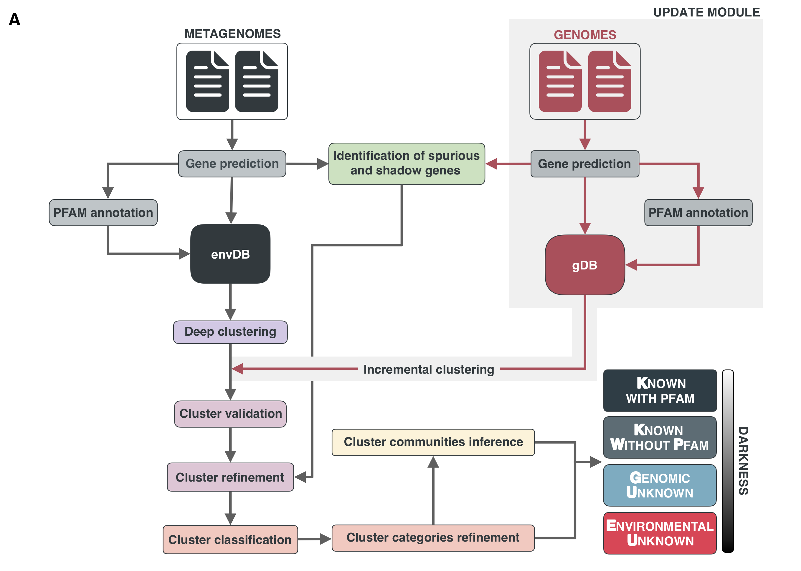

We implemented a bioinformatics workflow to structure and explored the consistent pool of genes with unknown function from marine and human microbiomes. We used a protein domain-based approach to partition more than 400 million predicted genes from 1,628 metagenomes and ~29 genomes into different categories of gene clusters of known and unknown functions.

_Workflow different modules_

 
 

The methods (included all the scripts/code) and results for each module are documented. Below you can find the links to the different reports:

[**DATA**](1_Data)

 

<h3 class="section-heading  text-primary">Workflow steps</h3>

-   [1. Gene prediction](2_Gene_prediction)
 
-   [2. MMseqs clustering](3_MMseqs_clustering)
 
-   [3. Pfam annotations](4_Pfam_annotation)
 
-   [4. Cluster validation](5_Cluster_validation)
 
-   [5. Cluster refinement](6_Cluster_refinement)
 
-   [6. Cluster classification in categories](7_Cluster_classification)
 
-   [7. Known-Unknown cluster category refinement](8_Known-Unknown_refinement)
 
-   [8. Cluster communities inference](9_Cluster_communities)

 

-   [**Cluster and communities overview**](8.1_Cluster_categories_overview)

-   [**Coverage of external databases**](10_Coverage_external_DBs)

-   [**EUs in TARA Ocean MAGs (PGUs)**](11_EUs_in_TARA_MAGs)

-   [**GTDB genome integration..**](12_GTDB_genome_integration)

-   [**Environmental analyses**](13_Environmental_analyses)

-   [**Phylogenomic analyses**](14_Phylogenomic_analyses)

-   [**TARA ocean OM-RGC-v.2 integration**](15_TARA_Ocean_OM-RGC-v2)

-   [**Results in numbers**](16_Cluster_DB_numbers)

<!---
 -   [**Workflow (usage)**](Workflow)
-->
